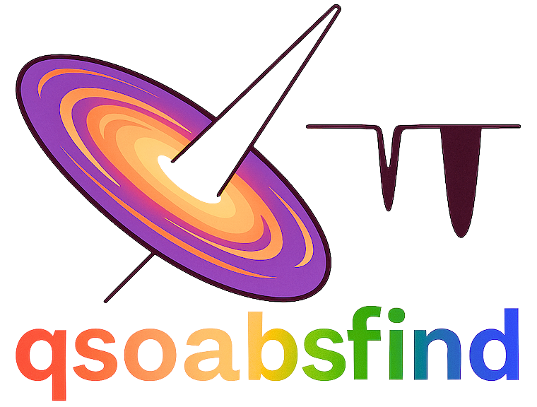

.. _qsoabsfind:

.. title:: qsoabsfind

|

qsoabsfind: Quasar Absorber Finder
----------------------------------

`qsoabsfind` is a Python module designed to detect absorbers with doublet properties in **SDSS** and **DESI** like low-resolution quasar spectra. It identifies potential absorption systems using a convolution-based, adaptive signal-to-noise approach, followed by Gaussian fitting and a series of rigorous checks to eliminate false positives.

The module also calculates rest-frame equivalent widths (EWs), FWHM and line centers using a double-Gaussian model. Optionally, it can calculate the total column densities of metal absorbers using the apparent optical depth method (AODM). The code offers flexibility to run with either default search parameters or user-provided custom search parameters.

Supported Metal Doublet Systems
-------------------------------

.. list-table::
   :widths: 15 20 20
   :header-rows: 1

   * - Absorber
     - Line 1 (Å)
     - Line 2 (Å)
   * - O VI (O⁵⁺)
     - 1031.93
     - 1037.62
   * - N V (N⁴⁺)
     - 1238.82
     - 1242.80
   * - Si IV (Si³⁺)
     - 1393.76
     - 1402.77
   * - C IV (C³⁺)
     - 1548.20
     - 1550.77
   * - Al III (Al²⁺)
     - 1854.72
     - 1862.79
   * - Fe II (Fe⁺)
     - 2586.65
     - 2600.17
   * - Mg II (Mg⁺)
     - 2796.35
     - 2803.52
  * - Na I (Na⁰)
     - 5891.58
     - 5897.57

Key Features
--------
- **Automated Search Window**: The code can dynamically define the observed-frame wavelength search window for each absorber system. Detailed definitions are provided in the `Search Window Documentation <https://qsoabsfind.readthedocs.io/en/latest/searchwindows.html>`_. Additionally, user can also provide the wavelength boundaries to search for metal systems through the search parameter constants file.
- **Flexible Search Parameters:** Supports user-provided custom search parameters for metal absorber detection. Please use the constant file format as described in ``Parameters File``.
- **Adaptive S/N convolution**: Detects doublet absorbers in low-resolution quasar spectra using a convolution-based, adaptive signal-to-noise method.
- **Rigorous selection criteria**: Identifies the best absorber candidates based on physically motivated thresholds and doublet properties. Optionally uses chi2 statistics to get the confidence level of the selected candidates.
- **Gaussian profile fitting**: Accurately models absorption lines to extract parameters like equivalent width, FWHM, and central wavelength.
- **Instrumental resolution correction**: Corrects measured line widths for instrumental resolution to infer intrinsic properties.
- **Column Densities**: Optionally estimates total column densities of detected absorbers using the apparent optical depth method (AODM; `Savage & Sembach 1991 <https://ui.adsabs.harvard.edu/abs/1991ApJ...379..245S/abstract>`_).
- **Parallel processing**: Supports efficient computation across large datasets using Python's ``multiprocessing`` module.
- **Comprehensive Output**: Detailed catalogs with redshifts, equivalent widths, S/N ratios, and more.
- **Descriptive Verbose**: Optionally prints the steps in great detail for debugging.

**qsoabsfind** is suitable for
---------
- Large absorber catalog construction
- Metal-line evolution studies
- CGM/IGM absorber statistics
- Survey-scale quasar spectral analysis

.. toctree::
   :maxdepth: 1
   :caption: Contents:

   installation
   fileformat
   searchwindows
   paramfile
   examplerun
   qsoabsfind

GitHub repository
-----------------

The source code is available on GitHub. Please see the `qsoabsfind <https://github.com/abhi0395/qsoabsfind>`_ repo. An `example jupyter notebook <https://github.com/abhi0395/qsoabsfind/blob/main/nb>`_ is also available.

Citation
--------

If you use this code in your analysis, please cite `Anand, Nelson & Kauffmann 2021 <https://arxiv.org/abs/2103.15842>`_ and `Anand et al. 2025 <https://arxiv.org/abs/2504.20299>`_. The BibTeX entries for these papers can be found below. Otherwise, they can also be copied from `here (2021 paper) <https://ui.adsabs.harvard.edu/abs/2021MNRAS.504...65A/exportcitation>`_ and `here (2025 paper) <https://ui.adsabs.harvard.edu/abs/2025arXiv250420299A/exportcitation>`_.

If you use this **codebase**, please also cite the associated `Zenodo record <https://zenodo.org/records/15685771>`_. Additionally, consider starring the repository if you find it useful or use it in your work.

You can also copy the BibTeX entry directly from below.

.. code-block:: bibtex

    @ARTICLE{2021MNRAS.504...65A,
      author = {{Anand}, Abhijeet and {Nelson}, Dylan and {Kauffmann}, Guinevere},
      title = "{Characterizing the abundance, properties, and kinematics of the cool circumgalactic medium of galaxies in absorption with SDSS DR16}",
      journal = {\mnras},
      keywords = {galaxies: evolution, galaxies: formation, large-scale structure of Universe, Astrophysics - Astrophysics of Galaxies},
      year = 2021,
      month = jun,
      volume = {504},
      number = {1},
      pages = {65-88},
      doi = {10.1093/mnras/stab871},
      archivePrefix = {arXiv},
      eprint = {2103.15842},
      primaryClass = {astro-ph.GA},
      adsurl = {https://ui.adsabs.harvard.edu/abs/2021MNRAS.504...65A},
      adsnote = {Provided by the SAO/NASA Astrophysics Data System}
    }

    @ARTICLE{2025ApJ...990..151A,
      author = {{Anand}, Abhijeet and {Aguilar}, J. and {Ahlen}, S. and {Bianchi}, D. and {Brodzeller}, A. and {Brooks}, D. and {Canning}, R. and {Claybaugh}, T. and {Cuceu}, A. and {de la Macorra}, A. and {Doel}, P. and {Ferraro}, S. and {Font-Ribera}, A. and {Forero-Romero}, J.~E. and {Gazta{\~n}aga}, E. and {Gontcho A Gontcho}, S. and {Gutierrez}, G. and {Guy}, J. and {Herrera-Alcantar}, H.~K. and {Ishak}, M. and {Juneau}, S. and {Kehoe}, R. and {Kremin}, A. and {Landriau}, M. and {Le Guillou}, L. and {Levi}, M.~E. and {Manera}, M. and {Meisner}, A. and {Miquel}, R. and {Moustakas}, J. and {Mu{\~n}oz-Guti{\'e}rrez}, A. and {Napolitano}, L. and {P{\'e}rez-R{\`a}fols}, I. and {Rossi}, G. and {Sanchez}, E. and {Schlegel}, D. and {Schubnell}, M. and {Sprayberry}, D. and {Tarl{\'e}}, G. and {Temple}, M.~J. and {Weaver}, B.~A. and {Zhou}, R.},
      title = "{The Cosmic Evolution of C IV Absorbers at 1.4 < z < 4.5: Insights from 100,000 Systems in DESI Quasars}",
      journal = {\apj},
      keywords = {Quasar absorption line spectroscopy, Intergalactic medium, Redshift surveys, Astronomy software, 1317, 813, 1378, 1855, Cosmology and Nongalactic Astrophysics},
      year = 2025,
      month = sep,
      volume = {990},
      number = {2},
      eid = {151},
      pages = {151},
      doi = {10.3847/1538-4357/adef3c},
      archivePrefix = {arXiv},
      eprint = {2504.20299},
      primaryClass = {astro-ph.CO},
      adsurl = {https://ui.adsabs.harvard.edu/abs/2025ApJ...990..151A},
      adsnote = {Provided by the SAO/NASA Astrophysics Data System}
    }

    @software{Anandqsoabsfind2025,
      author    = {{Anand}, Abhijeet},
      title     = "{qsoabsfind: A Python Package for Detecting Absorption Line Doublets in SDSS and DESI Quasar Spectra}",
      month     = jun,
      year      = 2025,
      publisher = {Zenodo},
      doi       = {10.5281/zenodo.15685771},
      url       = {https://doi.org/10.5281/zenodo.15685771}
    }

Contribution
------------

Contributions are welcome! Please submit a pull request or open an issue to discuss your ideas. If you have any questions/suggestions, please feel free to write to `abhijeetanand2011@gmail.com <mailto:abhijeetanand2011@gmail.com>`_ or, preferably, open a GitHub issue on the code `repo <https://github.com/abhi0395/qsoabsfind>`_.

| Thanks,
| Abhijeet Anand
| IUCAA, Pune & Lawrence Berkeley National Lab

Indices and tables
==================

* :ref:`genindex`
* :ref:`modindex`
* :ref:`search`
